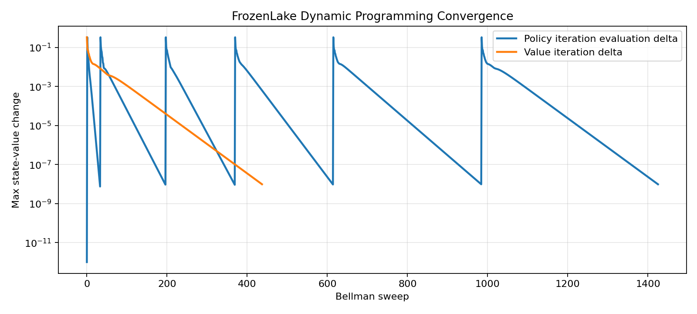
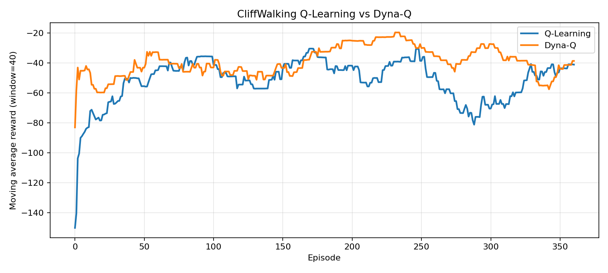
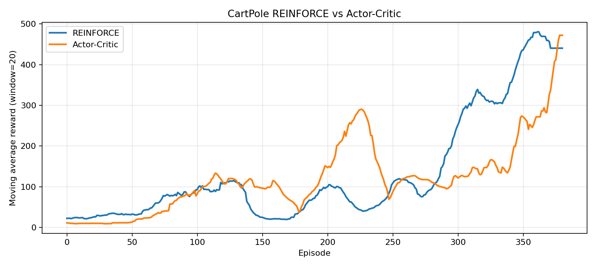
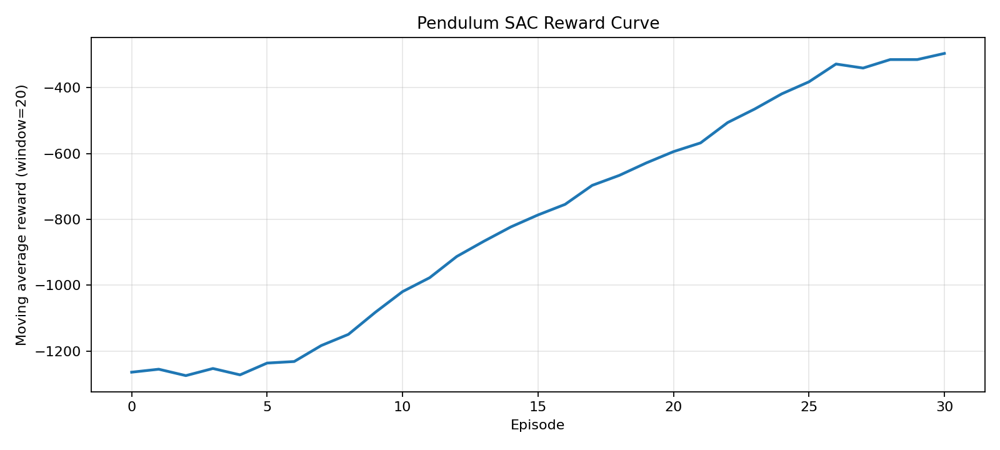

# 强化学习学习与实验

仓库整理了强化学习方向的中文学习笔记和配套实验。`notes/` 提供主阅读层，`experiments/` 提供实验入口。各条主线保留最小可运行代码、结果图和摘要文件，用于把概念、公式、训练现象与输出结果对应起来。

## 仓库导航

- [notes/README.md](notes/README.md)：章节顺序、笔记主线和章节定位。
- [experiments/README.md](experiments/README.md)：实验索引、运行入口和目录速查。
- [assets/figures/](assets/figures/)：主笔记和根 README 直接引用的结果图。

## 学习主线

| 章节 | 主题 | 主要内容 | 实验入口 |
| --- | --- | --- | --- |
| [00](notes/00-环境安装与运行.md) | 环境安装与运行 | 依赖、命令和目录结构概览 | [实验索引](experiments/README.md) |
| [01](notes/01-强化学习、状态、动作与Q值.md) | 强化学习基础概念 | 状态、动作和值函数的基础关系 | - |
| [02](notes/02-MDP、回报与Bellman方程.md) | MDP 与 Bellman 方程 | 回报、状态转移与 Bellman 递推的关系 | - |
| [03](notes/03-动态规划的策略评估、策略迭代与价值迭代.md) | 动态规划 | 已知模型下的策略评估、策略改进与 Bellman 求解 | [FrozenLake DP 实验](experiments/01-frozenlake-dp/README.md) |
| [04](notes/04-Q-Learning的值传播与Q表更新.md) | Q-Learning | 观察奖励如何沿着成功轨迹向前传播 | [FrozenLake Q-Learning 实验](experiments/02-frozenlake-tabular-q/README.md) |
| [05](notes/05-SARSA的时序更新与策略差异.md) | SARSA | 比较 on-policy 更新和风险敏感策略 | [CliffWalking SARSA 实验](experiments/03-cliffwalking-tabular-sarsa/README.md) |
| [06](notes/06-MonteCarlo的整局回报与动作价值更新.md) | Monte Carlo Control | 把整局回报和最终策略边界联系起来 | [Blackjack 实验](experiments/04-blackjack-monte-carlo/README.md) |
| [07](notes/07-n-step-SARSA的多步回报与折中更新.md) | n-step SARSA | 观察多步回报如何折中单步 TD 和整局回报 | [CliffWalking n-step 实验](experiments/05-cliffwalking-n-step-sarsa/README.md) |
| [08](notes/08-Dyna-Q的模型学习与规划更新.md) | Dyna-Q | 从真实交互中学习模型，再用规划更新重复利用经验 | [CliffWalking Dyna-Q 实验](experiments/06-cliffwalking-dyna-q/README.md) |
| [09](notes/09-DQN的经验回放与目标网络.md) | DQN | 从表格型值方法过渡到神经网络动作价值函数 | [CartPole DQN 实验](experiments/07-cartpole-dqn/README.md) |
| [10](notes/10-REINFORCE的回合策略梯度与高方差问题.md) | REINFORCE | 直接优化策略并观察整局回报带来的高方差 | [CartPole REINFORCE 实验](experiments/08-cartpole-reinforce/README.md) |
| [11](notes/11-Actor-Critic的价值基线与同步更新.md) | Actor-Critic | 用价值基线稳定策略梯度并同步更新策略与价值 | [CartPole Actor-Critic 实验](experiments/09-cartpole-actor-critic/README.md) |
| [12](notes/12-PPO的裁剪目标与稳定策略更新.md) | PPO | 用裁剪目标和 `GAE` 稳定 on-policy 深度策略优化 | [LunarLander PPO 实验](experiments/10-lunarlander-ppo/README.md) |
| [13](notes/13-SAC的最大熵目标与连续动作控制.md) | SAC | 用最大熵目标、双 critic 与随机策略处理连续动作 | [Pendulum SAC 实验](experiments/11-pendulum-sac/README.md) |

## 结果速览

| 主线 | 代表结果 | 主要看点 |
| --- | --- | --- |
| FrozenLake / Dynamic Programming | 评估平均奖励 `0.755`，成功率 `0.755` | Bellman 备份在已知模型下如何稳定收敛 |
| FrozenLake / Q-Learning | 评估平均奖励 `0.73`，成功率 `0.73` | 训练曲线如何随着值传播逐步抬升 |
| CliffWalking / SARSA | 评估平均回报 `-17.0`，平均掉崖次数 `0.0` | 虽然不是最短路，但更稳定地避开高风险区域 |
| Blackjack / Monte Carlo | 评估平均回报 `-0.0413`，胜率 `0.4350` | 策略边界如何随整局回报统计逐渐变清楚 |
| CliffWalking / 4-step SARSA | 评估平均回报 `-19.0`，平均掉崖次数 `0.0` | 多步回报改变了早期信用分配节奏 |
| CliffWalking / Dyna-Q | 评估平均回报 `-13.0`，平均掉崖次数 `0.0` | 规划更新提高了同等交互量下的学习速度 |
| CartPole / DQN | 评估平均回报 `500.0`，成功率 `1.0` | 经验回放与目标网络让深度值函数稳定训练 |
| CartPole / REINFORCE | 评估平均回报 `498.0`，成功率 `0.9` | 直接策略梯度可以工作，但方差明显更大 |
| CartPole / Actor-Critic | 评估平均回报 `500.0`，成功率 `1.0` | 价值基线显著改善策略梯度稳定性 |
| LunarLander / PPO | 评估平均回报 `-46.3309`，平均回合长度 `425.3` | 裁剪目标使训练稳定，但当前基线尚未稳定着陆 |
| Pendulum / SAC | 评估平均回报 `-178.3184`，平均回合长度 `200.0` | 最大熵目标把仓库主线扩展到连续动作控制 |

## 精选展示

### Dynamic Programming / FrozenLake

收敛曲线用于观察：在已知环境模型时，策略迭代和价值迭代都在重复执行 Bellman 备份，只是组织方式不同。

<p align="center">
  
</p>

### Q-Learning / FrozenLake

奖励曲线用于观察成功轨迹首次出现后，终点奖励向前传播的过程。

<p align="center">
  
</p>

### Dyna-Q / CliffWalking

`Dyna-Q` 的关键现象不是最终一定得到更短路径，而是在同等真实交互量下，通过规划更新更快传播已有经验。

<p align="center">
  
</p>

### Actor-Critic / CartPole

引入价值基线后，训练曲线比纯 `REINFORCE` 更稳定，且更快逼近满回报。

<p align="center">
  
</p>

### PPO / LunarLander

当前 `PPO` 基线已经能把回合长度拉高，但平均回报仍未转正。该结果主要用于展示裁剪目标和批量 on-policy 更新的稳定化作用。

<p align="center">
  
</p>

### SAC / Pendulum

`SAC` 的关键现象是：策略不再输出离散动作，而是输出连续动作分布，并把策略熵显式写进目标值中。

<p align="center">
  
</p>

## 快速开始

仓库根目录的环境定义如下：

```bash
conda env create -f environment.yml
conda activate ReinforcementLearning
```

纯 `pip` 环境建议先安装 `swig`，再安装项目依赖：

```bash
pip install swig
pip install -r requirements.txt
```

首个实验命令如下：

```bash
cd experiments/01-frozenlake-dp
python train.py --render-final-policy
```

更多运行方式见 [00-环境安装与运行](notes/00-环境安装与运行.md)。

## 仓库结构

```text
ReinforcementLearning-Study-and-Experiments/
├─ assets/
│  └─ figures/
├─ experiments/
│  ├─ README.md
│  ├─ 01-frozenlake-dp/
│  ├─ 02-frozenlake-tabular-q/
│  ├─ 03-cliffwalking-tabular-sarsa/
│  ├─ 04-blackjack-monte-carlo/
│  ├─ 05-cliffwalking-n-step-sarsa/
│  ├─ 06-cliffwalking-dyna-q/
│  ├─ 07-cartpole-dqn/
│  ├─ 08-cartpole-reinforce/
│  ├─ 09-cartpole-actor-critic/
│  ├─ 10-lunarlander-ppo/
│  └─ 11-pendulum-sac/
├─ notes/
│  ├─ README.md
│  ├─ 00-环境安装与运行.md
│  ├─ 01-强化学习、状态、动作与Q值.md
│  ├─ 02-MDP、回报与Bellman方程.md
│  ├─ 03-动态规划的策略评估、策略迭代与价值迭代.md
│  ├─ 04-Q-Learning的值传播与Q表更新.md
│  ├─ 05-SARSA的时序更新与策略差异.md
│  ├─ 06-MonteCarlo的整局回报与动作价值更新.md
│  ├─ 07-n-step-SARSA的多步回报与折中更新.md
│  ├─ 08-Dyna-Q的模型学习与规划更新.md
│  ├─ 09-DQN的经验回放与目标网络.md
│  ├─ 10-REINFORCE的回合策略梯度与高方差问题.md
│  ├─ 11-Actor-Critic的价值基线与同步更新.md
│  ├─ 12-PPO的裁剪目标与稳定策略更新.md
│  └─ 13-SAC的最大熵目标与连续动作控制.md
├─ environment.yml
├─ requirements.txt
└─ README.md
```

## 开源协议

仓库中的代码和文档基于 [MIT License](LICENSE) 开源。第三方环境、数据集或外部资料仍遵循各自原始许可。
