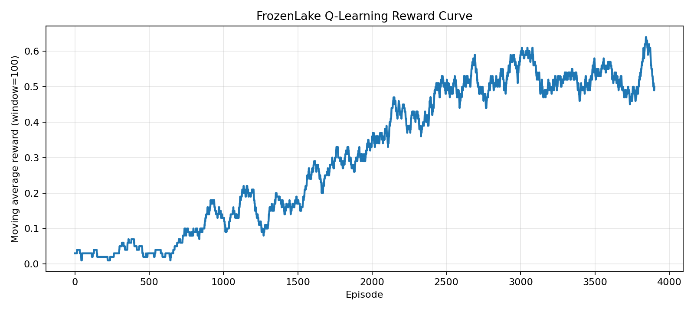
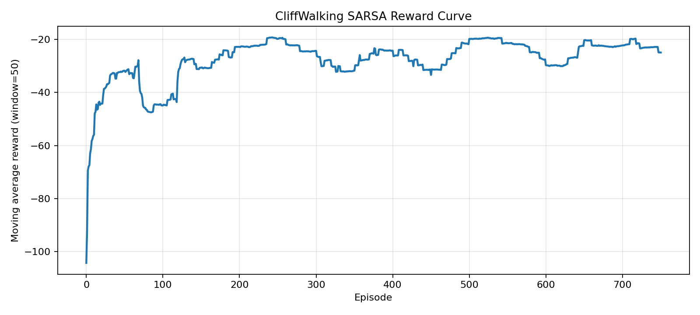

# 强化学习学习与实验

这个仓库整理了强化学习方向的中文学习笔记和配套实验。主阅读层放在 `notes/`，实验入口放在 `experiments/`，每条主线都尽量保留最小可运行代码和结果图，方便把概念解释和训练现象连起来看。

## 仓库导航

- [notes/README.md](notes/README.md)：章节顺序、阅读建议和笔记主线。
- [experiments/README.md](experiments/README.md)：实验索引、运行入口和目录速查。
- [assets/figures/](assets/figures/)：主笔记和 README 中直接引用的结果图。

## 学习主线

| 章节 | 主题 | 主要内容 | 实验入口 |
| --- | --- | --- | --- |
| [00](notes/00-环境安装与运行.md) | 环境安装与运行 | 先把依赖、命令和目录结构跑通 | [实验索引](experiments/README.md) |
| [01](notes/01-强化学习、状态、动作与Q值.md) | 强化学习基础概念 | 从状态、动作和值函数建立最小直觉 | - |
| [02](notes/02-MDP、回报与Bellman方程.md) | MDP 与 Bellman 方程 | 把回报、状态转移和 Bellman 递推串起来 | - |
| [03](notes/03-Q-Learning的值传播与Q表更新.md) | Q-Learning | 观察奖励如何沿着成功轨迹向前传播 | [FrozenLake 实验](experiments/01-frozenlake-tabular-q/README.md) |
| [04](notes/04-SARSA的时序更新与策略差异.md) | SARSA | 比较 on-policy 更新和风险敏感策略 | [CliffWalking 实验](experiments/02-cliffwalking-tabular-sarsa/README.md) |
| [05](notes/05-MonteCarlo的整局回报与动作价值更新.md) | Monte Carlo Control | 把整局回报和最终策略边界联系起来 | [Blackjack 实验](experiments/03-blackjack-monte-carlo/README.md) |

## 结果速览

| 主线 | 代表结果 | 主要看点 |
| --- | --- | --- |
| FrozenLake / Q-Learning | 评估平均奖励 `0.73`，成功率 `0.73` | 训练曲线如何随着值传播逐步抬升 |
| CliffWalking / SARSA | 评估平均回报 `-17.0`，平均掉崖次数 `0.0` | 虽然不是最短路，但更稳定地避开高风险区域 |
| Blackjack / Monte Carlo | 评估平均回报 `-0.0413`，胜率 `0.4350` | 策略边界如何随整局回报统计逐渐变清楚 |

## 精选展示

### Q-Learning / FrozenLake

奖励曲线最适合拿来观察成功轨迹首次出现后，终点奖励如何一轮轮向前传播。

<p align="center">
  
</p>

### SARSA / CliffWalking

`SARSA` 的典型现象不是最短路，而是把探索风险算进动作价值后形成更稳健的路径选择。

<p align="center">
  
</p>

### Monte Carlo / Blackjack

策略热力图可以把“有无可用 `A`”两种情况下的决策边界直接摆到一起比较。

<p align="center">
  
</p>

## 快速开始

推荐使用仓库根目录的环境定义：

```bash
conda env create -f environment.yml
conda activate ReinforcementLearning
```

如果不使用 `conda`：

```bash
pip install -r requirements.txt
```

运行第一个实验：

```bash
cd experiments/01-frozenlake-tabular-q
python train.py --episodes 4000 --render-final-policy
```

更多运行方式见 [00-环境安装与运行](notes/00-环境安装与运行.md)。

## 仓库结构

```text
ReinforcementLearning-Study-and-Experiments/
├─ assets/
│  └─ figures/
├─ experiments/
│  ├─ README.md
│  ├─ 01-frozenlake-tabular-q/
│  ├─ 02-cliffwalking-tabular-sarsa/
│  └─ 03-blackjack-monte-carlo/
├─ notes/
│  ├─ README.md
│  ├─ 00-环境安装与运行.md
│  ├─ 01-强化学习、状态、动作与Q值.md
│  ├─ 02-MDP、回报与Bellman方程.md
│  ├─ 03-Q-Learning的值传播与Q表更新.md
│  ├─ 04-SARSA的时序更新与策略差异.md
│  └─ 05-MonteCarlo的整局回报与动作价值更新.md
├─ environment.yml
├─ requirements.txt
└─ README.md
```

## 开源协议

仓库中的代码和文档基于 [MIT License](LICENSE) 开源。第三方环境、数据集或外部资料仍遵循各自原始许可。
