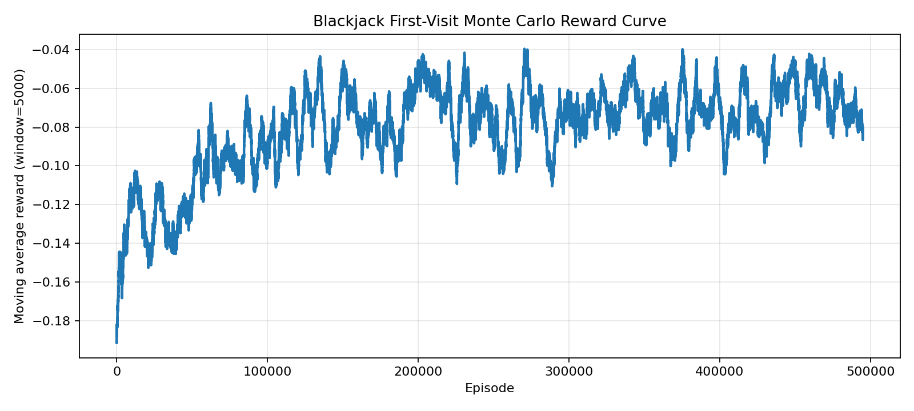

# Blackjack 首次访问蒙特卡洛

这个实验用 `Blackjack-v1` 演示 `First-Visit Monte Carlo Control` 如何在回合结束后，用整局回报更新动作价值。

## 这个实验在回答什么问题

- 为什么 `Monte Carlo` 不能像 `Q-Learning` 那样走一步更一步
- `First-Visit` 到底是什么意思
- `Blackjack` 中策略边界会怎样随庄家明牌和可用 A 改变

## 环境与方法

- 环境：`Blackjack-v1`
- 方法：`First-Visit Monte Carlo Control`
- 状态：`(player_sum, dealer_showing, usable_ace)`
- 动作：`Stick / Hit`
- 输出：训练曲线、策略热力图、状态价值热力图、评估结果、Q 表

## 运行方式

```bash
cd experiments/03-blackjack-monte-carlo
python train.py --episodes 200000 --render-final-policy
```

常用命令：

```bash
python train.py --episodes 300000 --epsilon-start 0.2 --epsilon-end 0.03 --epsilon-decay 0.999992 --run-name blackjack-mc-300k
python train.py --episodes 80000 --epsilon-start 0.15 --epsilon-end 0.05 --epsilon-decay 0.99998 --run-name blackjack-mc-fast
python trace_mc_updates.py --episodes 3
```

## 输出文件

训练结束后会在 `outputs/<run_name>/` 下生成：

- `summary.json`
- `reward_curve.png`
- `policy_heatmaps.png`
- `value_heatmaps.png`

## 代表性结果


| 运行名 | 回合数 | 平均奖励 | 胜率 | 平局率 | 负率 |
| --- | ---: | ---: | ---: | ---: | ---: |
| `monte-carlo-reference-500k` | 500000 | `-0.0413` | `0.4350` | `0.0887` | `0.4763` |

如果要看训练过程，可以再配合：



## 对应笔记

- [06-MonteCarlo是怎么用整局回报更新动作价值的](../../notes/06-MonteCarlo是怎么用整局回报更新动作价值的.md)
- [04-SARSA是怎么用下一步真实动作更新Q表的](../../notes/04-SARSA是怎么用下一步真实动作更新Q表的.md)
- [05-SARSA和Q-Learning在CliffWalking里会学出什么区别](../../notes/05-SARSA和Q-Learning在CliffWalking里会学出什么区别.md)
- [00-环境安装与运行](../../notes/00-环境安装与运行.md)
