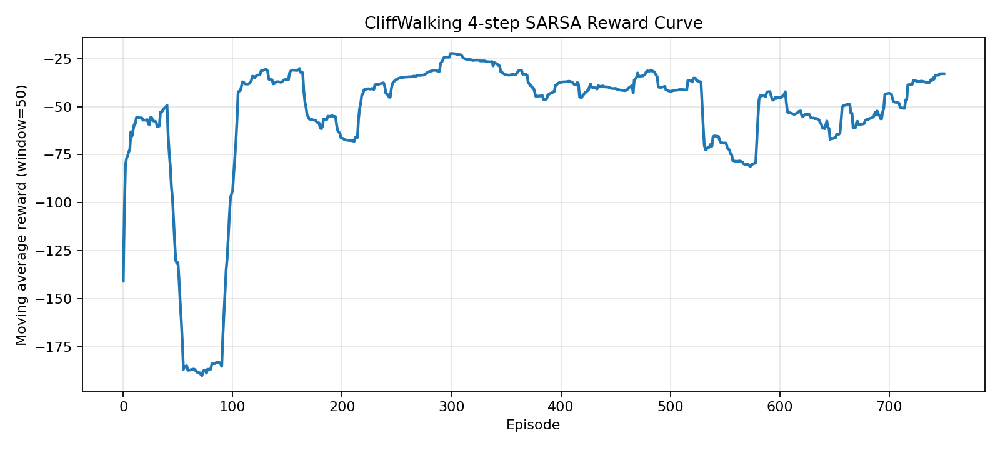

# CliffWalking 表格型 n-step SARSA

这个目录保存 `CliffWalking-v1` 上的表格型 `n-step SARSA` 代码和最小运行说明，用于展示多步回报如何在单步时序差分与整局回报之间提供折中。

## 关联笔记

- [07-n-step SARSA的多步回报与折中更新](../../notes/07-n-step-SARSA的多步回报与折中更新.md)

## 实验内容

- 完整训练入口 `train.py`
- 固定安全路径的多步更新追踪脚本 `trace_n_step_updates.py`
- 与 `1-step SARSA` 的对比脚本 `compare_one_step_n_step_sarsa.py`

## 代表结果

- 回合数：`800`
- 多步设置：`4-step`
- 评估平均回报：`-19.0`
- 平均到达步数：`19.0`
- 平均掉崖次数：`0.0`

<p align="center">
  
</p>

## 运行命令

```bash
cd experiments/05-cliffwalking-n-step-sarsa
python train.py --episodes 800 --n-step 4 --render-final-policy
python train.py --episodes 1200 --n-step 6 --alpha 0.5 --gamma 0.99 --epsilon-start 0.1 --epsilon-end 0.1 --epsilon-decay 1.0
python trace_n_step_updates.py --episodes 3 --n-step 4
python compare_one_step_n_step_sarsa.py --episodes 800 --n-step 4
```

## 输出目录

- `outputs/<run_name>/summary.json`
- `outputs/<run_name>/reward_curve.png`
- `outputs/comparisons/<run_name>/comparison_summary.json`
- `outputs/comparisons/<run_name>/comparison_reward_curve.png`

## 代码入口

| 路径 | 作用 |
| --- | --- |
| `train.py` | 完整训练入口 |
| `trace_n_step_updates.py` | 固定安全路径的多步更新追踪脚本 |
| `compare_one_step_n_step_sarsa.py` | 和 `1-step SARSA` 的对比脚本 |
