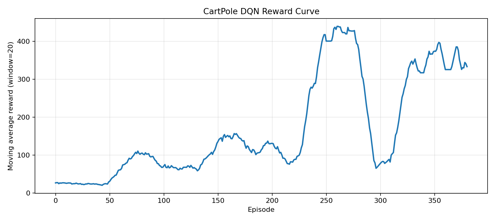

# CartPole `DQN`

这个目录保存 `CartPole-v1` 上的 vanilla `DQN` 代码和最小运行说明，用于展示经验回放与目标网络如何把表格型 `Q-Learning` 推进到神经网络值函数。

## 关联笔记

- [09-DQN的经验回放与目标网络](../../notes/09-DQN的经验回放与目标网络.md)

## 实验内容

- 完整训练入口 `train.py`
- 用固定小批量打印 `TD target`、预测值与损失的教学脚本 `trace_dqn_updates.py`
- 奖励曲线、损失曲线和训练摘要导出

## 代表结果

- 回合数：`400`
- 评估平均回报：`500.0`
- 评估平均回合长度：`500.0`
- 成功率：`1.0`

<p align="center">
  
</p>

## 运行命令

```bash
cd experiments/07-cartpole-dqn
python train.py --episodes 400 --print-eval-rollout
python train.py --episodes 10 --batch-size 8 --buffer-capacity 256 --learning-starts 32 --eval-episodes 5 --run-name smoke
python trace_dqn_updates.py
```

## 输出目录

- `outputs/<run_name>/summary.json`
- `outputs/<run_name>/reward_curve.png`
- `outputs/<run_name>/loss_curve.png`

## 代码入口

| 路径 | 作用 |
| --- | --- |
| `train.py` | 完整训练入口 |
| `trace_dqn_updates.py` | 打印一个固定 minibatch 的 `DQN` 更新细节 |
