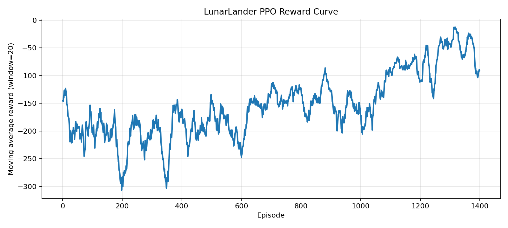

# LunarLander `PPO`

这个目录保存 `LunarLander-v3` 上的离散动作 `PPO-Clip` 代码和最小运行说明，用于展示裁剪目标、并行采样与 `GAE` 如何配合稳定 on-policy 更新。

## 关联笔记

- [12-PPO的裁剪目标与稳定策略更新](../../notes/12-PPO的裁剪目标与稳定策略更新.md)

## 实验内容

- 完整训练入口 `train.py`
- 打印裁剪前后 surrogate objective 的教学脚本 `trace_ppo_clipping.py`
- 奖励曲线、损失曲线和训练摘要导出

## 代表结果

- 总环境步数：`200000`
- 评估平均回报：`-46.3309`
- 评估平均回合长度：`425.3`
- 成功率：`0.0`

<p align="center">
  
</p>

## 运行命令

```bash
cd experiments/10-lunarlander-ppo
python train.py --total-env-steps 200000
python train.py --total-env-steps 4096 --num-envs 4 --rollout-steps 128 --update-epochs 2 --minibatch-size 128 --eval-episodes 3 --run-name smoke
python trace_ppo_clipping.py
```

## 输出目录

- `outputs/<run_name>/summary.json`
- `outputs/<run_name>/reward_curve.png`
- `outputs/<run_name>/loss_curve.png`

## 代码入口

| 路径 | 作用 |
| --- | --- |
| `train.py` | 完整训练入口 |
| `trace_ppo_clipping.py` | 打印裁剪前后的 surrogate objective |
