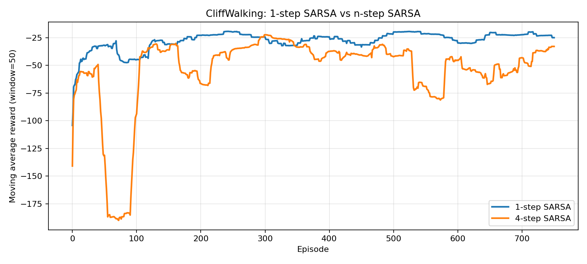

# n-step SARSA的多步回报与折中更新

本节讨论 `n-step SARSA` 如何用多步真实奖励和一个自举项共同构造更新目标。与 `SARSA` 的单步更新相比，`n-step SARSA` 会先累积若干步真实奖励，再用更远处的状态动作价值补上尾项。

## 为什么它正好夹在单步 TD 和 Monte Carlo 中间

`SARSA` 的目标值只看一步：

$$
r_{t+1} + \gamma Q(s_{t+1}, a_{t+1})
$$

`Monte Carlo` 会等整局结束后再用整局真实回报更新：

$$
G_t = r_{t+1} + \gamma r_{t+2} + \gamma^2 r_{t+3} + \cdots
$$

`n-step SARSA` 位于这两者之间：

- 先看前面若干步真实奖励
- 再在第 `n` 步的位置接一个自举项

因此它有两个极端：

- 当 `n = 1` 时，它就退化成普通 `SARSA`
- 当一局在第 `n` 步之前结束时，它就只剩真实奖励累加，形式上更接近 `Monte Carlo`

## n-step 回报怎么定义

如果从时间步 `t` 开始，后面至少还能继续 `n` 步，那么 `n-step return` 可以写成：

$$
G_t^{(n)} = r_{t+1} + \gamma r_{t+2} + \gamma^2 r_{t+3} + \cdots + \gamma^{n-1} r_{t+n} + \gamma^n Q(s_{t+n}, a_{t+n})
$$

如果回合在这之前已经结束，那么最后那一项自举值会消失，只保留到终局为止的真实奖励。

更新式如下：

$$
Q(s_t, a_t) \leftarrow Q(s_t, a_t) + \alpha \left[ G_t^{(n)} - Q(s_t, a_t) \right]
$$

这个更新可以表述为：先拿到几步已经发生的结果，再用更远处一个当前价值估计补全剩余未来。

## 一个最小例子

在当前仓库的 `CliffWalking` 追踪脚本里，固定安全路径的前四步奖励都是 `-1`。当 `n = 4`、$\gamma = 0.99$ 且当前自举项还没学出来时，有：

$$
G_0^{(4)} = -1 - 0.99 - 0.99^2 - 0.99^3 = -3.940399
$$

如果学习率 $\alpha = 0.5$，那么第一轮第一个被更新的状态动作对就是：

$$
Q(36, U) \leftarrow 0 + 0.5 \cdot (-3.940399 - 0) = -1.9701995
$$

这说明 `n-step SARSA` 和 `1-step SARSA` 的一个直接差异如下：

- `1-step SARSA` 第一轮只会先看到一步代价
- `4-step SARSA` 第一轮就能把前四步累计代价记到更早的动作上

## 为什么继续用 `CliffWalking`

`CliffWalking-v1` 继续作为本节主实验，原因如下：

- 每一步代价固定为 `-1`，多步回报更容易直接解释
- 掉崖区域带来明显高风险，路径差异容易比较
- 可以直接和上一节 `SARSA` 的结果做对应

在这个环境里，多步回报的重点不在“是否一定更优”，而在“更早的状态何时开始感受到后续代价”。

## 固定安全路径看多步更新

本节继续沿用上一节的安全路径：

```text
U -> R -> R -> R -> R -> R -> R -> R -> R -> R -> R -> R -> D
```

这条路径总共 `13` 步，每一步奖励都是 `-1`。和 `1-step SARSA` 不同，`4-step SARSA` 不会在第 `1`、`2`、`3` 步就立刻更新最早的状态动作对，而是要等累计到第 `4` 步后，才第一次更新起点动作。

下面这些数值来自更新追踪脚本的真实输出：

| Episode | $Q(36, U)$ | $Q(24, R)$ | $Q(25, R)$ | $Q(34, R)$ | $Q(35, D)$ |
| ------- | ---------: | ---------: | ---------: | ---------: | ---------: |
| 0 | 0.000000 | 0.000000 | 0.000000 | 0.000000 | 0.000000 |
| 1 | -1.970200 | -1.970200 | -1.970200 | -0.995000 | -0.500000 |
| 2 | -3.901582 | -3.901582 | -3.901582 | -1.492500 | -0.750000 |
| 3 | -5.794913 | -5.794913 | -5.682995 | -1.741250 | -0.875000 |

表格体现的现象如下：

- 起点附近的动作在第一轮第 `4` 步之后就已经出现明显负值
- 越接近终点的位置，可累积的真实奖励越少，尾部更新更接近短回报
- 回合结束前最后几步不再带自举项，而是只使用剩余真实奖励

## 放到完整训练里会看到什么

当前仓库的 `4-step SARSA` 基线实验结果是：

- 回合数：`800`
- 评估平均回报：`-19.0`
- 平均到达步数：`19.0`
- 平均掉崖次数：`0.0`

同一组配置下，`1-step SARSA` 和 `4-step SARSA` 的对比结果如下：

- `1-step SARSA` 评估平均回报：`-17.0`
- `4-step SARSA` 评估平均回报：`-19.0`
- 两者评估阶段平均掉崖次数都为 `0.0`

<p align="center">
  
</p>

当前基线结果体现的重点如下：

- 多步回报确实改变了信用分配节奏
- 在当前随机种子和超参数下，`4-step SARSA` 没有学到更短路径，反而形成了更长的安全路径
- `n-step` 的价值不在于保证更高分，而在于改变“早期状态何时拿到后续代价信息”

## 与 `1-step SARSA` 的对比维度

与 `1-step SARSA` 的对比维度包括：

- 单次更新中会显式使用多少步真实奖励
- 自举项出现在多远的位置
- 起点附近动作要等多久才会被更新
- 最终贪心路径的长度和是否避开悬崖

这个主题的重点不是把 `n-step` 简化成“更好”或“更差”，而是明确它改变的是目标值的构造方式。

## 代码位置

训练脚本：

- [train.py](../experiments/04-cliffwalking-n-step-sarsa/train.py)

直接运行：

```bash
cd experiments/04-cliffwalking-n-step-sarsa
python train.py --episodes 800 --n-step 4 --render-final-policy
python compare_one_step_n_step_sarsa.py --episodes 800 --n-step 4
```

核心更新如下：

```python
for index in range(tau + 1, upper_bound + 1):
    discounted_return += (config.gamma ** (index - tau - 1)) * rewards[index]

if terminal_time is None or tau + config.n_step < terminal_time:
    discounted_return += (
        config.gamma**config.n_step
        * q_table[states[tau + config.n_step], actions[tau + config.n_step]]
    )

q_table[states[tau], actions[tau]] += config.alpha * (
    discounted_return - q_table[states[tau], actions[tau]]
)
```

这段代码对应的含义如下：前半段累积真实奖励，后半段在回合尚未结束时补上第 `n` 步位置的自举项。

## 追踪脚本和对比脚本

- [trace_n_step_updates.py](../experiments/04-cliffwalking-n-step-sarsa/trace_n_step_updates.py)
- [compare_one_step_n_step_sarsa.py](../experiments/04-cliffwalking-n-step-sarsa/compare_one_step_n_step_sarsa.py)

运行：

```bash
cd experiments/04-cliffwalking-n-step-sarsa
python trace_n_step_updates.py --episodes 3 --n-step 4
python compare_one_step_n_step_sarsa.py --episodes 800 --n-step 4
```

两类脚本的作用不同：

- `trace` 脚本固定一条安全路径，只展示多步回报如何延迟并放大早期更新
- `compare` 脚本让 `1-step` 和 `4-step` 自己训练，再比较最终策略和路径差异

## 对应内容

- [04-cliffwalking-n-step-sarsa](../experiments/04-cliffwalking-n-step-sarsa/README.md)
- [04-SARSA的时序更新与策略差异](./04-SARSA的时序更新与策略差异.md)
- [05-MonteCarlo的整局回报与动作价值更新](./05-MonteCarlo的整局回报与动作价值更新.md)
