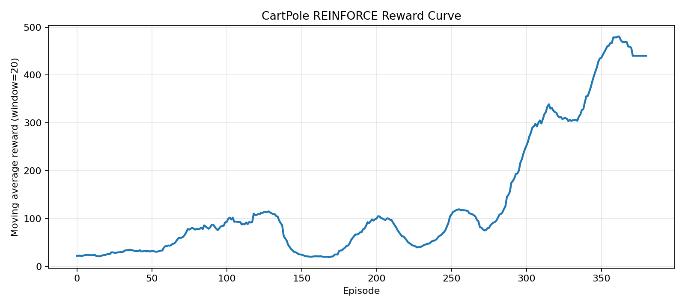

# REINFORCE的回合策略梯度与高方差问题

本章补齐“直接优化策略”的第一条主线：不再先学动作价值函数，而是直接把整局回报写进策略梯度目标。

## 本章目标

- 说明 `REINFORCE` 如何直接优化参数化策略。
- 理解整局回报作为权重时的高方差来源。
- 建立 `REINFORCE -> Actor-Critic` 的过渡背景。

## 本章实验

- 主环境：`CartPole-v1`
- 方法：无价值基线的 `REINFORCE`
- 关键配置：`MLP(4->128->128->2)`，回合结束后一次策略更新

## 关键结果

当前仓库基线结果如下：

- 回合数：`400`
- 评估平均回报：`498.0`
- 评估平均回合长度：`498.0`
- 成功率：`0.9`

<p align="center">
  
</p>

## 核心机制

### 策略目标

参数化策略记为：

$$
\pi_\theta(a \mid s)
$$

`REINFORCE` 的核心目标是最大化期望回报：

$$
J(\theta)=\mathbb{E}_{\tau \sim \pi_\theta}[G_0]
$$

### 回合策略梯度

当前实现使用 reward-to-go 形式：

$$
\nabla_\theta J(\theta)\propto \sum_t G_t \nabla_\theta \log \pi_\theta(a_t \mid s_t)
$$

每一步动作的对数概率，都会被该步之后的累计回报加权。

### 为什么高方差

- 回报必须等整局结束后才能构造。
- 早期动作会同时背负大量未来随机性的影响。
- 没有价值基线时，梯度权重的波动较大。

当前实现仅做回合内回报标准化，不引入额外价值基线。

### 为什么使用 `CartPole`

`CartPole` 的奖励结构简单、状态维度小，适合把“整局回报驱动的策略更新”现象和训练曲线对应起来。

## 代码与脚本

### 代码入口

- [train.py](../experiments/08-cartpole-reinforce/train.py)
- [trace_reinforce_returns.py](../experiments/08-cartpole-reinforce/trace_reinforce_returns.py)

### 运行命令

```bash
cd experiments/08-cartpole-reinforce
python train.py --episodes 400
python train.py --episodes 100 --eval-episodes 10 --run-name smoke
python trace_reinforce_returns.py
```

### 脚本说明

- `train.py`：完整训练、评估与曲线导出。
- `trace_reinforce_returns.py`：打印一个玩具回合的回报与策略损失权重。

核心损失构造如下：

```python
returns = discounted_returns(rewards, config.gamma).to(device)
policy_loss = -(torch.stack(log_probs) * returns).sum()
```

### 输出文件

- `outputs/<run_name>/summary.json`
- `outputs/<run_name>/reward_curve.png`
- `outputs/<run_name>/loss_curve.png`

## 小结

`REINFORCE` 证明了“不依赖值函数也能直接学策略”，但代价是高方差和较弱的样本效率。引入价值基线后，策略梯度主线才真正进入更稳定的工程区间。

## 继续阅读

- [11-Actor-Critic的价值基线与同步更新](./11-Actor-Critic的价值基线与同步更新.md)
- [08-cartpole-reinforce](../experiments/08-cartpole-reinforce/README.md)
