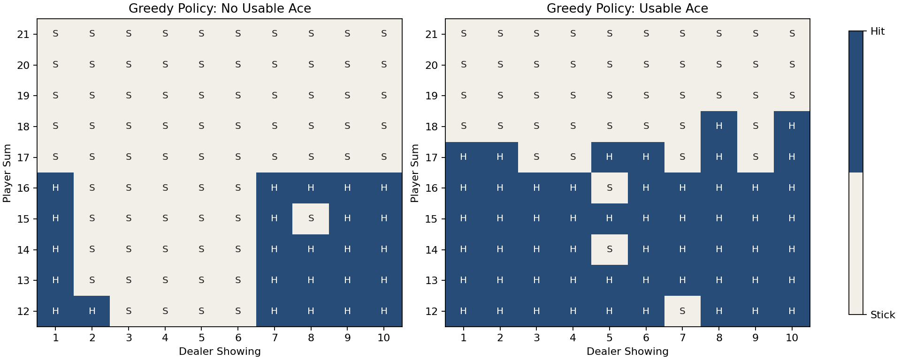

# Blackjack 首次访问蒙特卡洛（First-Visit Monte Carlo）

一个面向“表格控制之后下一步该学什么”的完整教学项目，用 `Blackjack-v1` 演示首次访问蒙特卡洛控制（`First-Visit Monte Carlo Control`）如何依靠整局回报来学习动作价值。

## 项目目标

- 理解蒙特卡洛（`Monte Carlo`）为什么必须等一整局结束后才能更新
- 看清首次访问（`First-Visit`）和“每一步都立刻更新”的时序差分（`TD`）方法有什么本质区别
- 观察 `Blackjack` 中有无可用 A（`usable ace`）时，策略边界为什么会不同

## 环境与算法

- 环境：`Blackjack-v1`
- 算法：首次访问蒙特卡洛控制（`First-Visit Monte Carlo Control`）
- 状态：`(player_sum, dealer_showing, usable_ace)`
- 动作：`Stick / Hit`
- 输出内容：训练曲线、策略热力图、状态价值热力图、评估胜率与平局率、Q 表

## 运行方式

在仓库根目录准备环境后，执行：

```bash
cd projects/03-blackjack-monte-carlo
python train.py --episodes 200000 --render-final-policy
```

如需安装最小依赖：

```bash
pip install -r ../requirements.txt
```

## 常用命令

训练一个更稳定的基线：

```bash
python train.py --episodes 300000 --epsilon-start 0.2 --epsilon-end 0.03 --epsilon-decay 0.999992 --run-name blackjack-mc-300k
```

如果想更快先看出策略形状：

```bash
python train.py --episodes 80000 --epsilon-start 0.15 --epsilon-end 0.05 --epsilon-decay 0.99998 --run-name blackjack-mc-fast
```

查看蒙特卡洛（`Monte Carlo`）的整局回报更新过程：

```bash
python trace_mc_updates.py --episodes 3
```

## 输出文件

训练完成后会在 `outputs/<run_name>/` 下生成：

- `summary.json`：训练参数、评估指标、策略表、状态价值和 Q 表
- `reward_curve.png`：平滑后的训练奖励曲线
- `policy_heatmaps.png`：有无可用 A（`usable ace`）两种情况下的最终贪心策略
- `value_heatmaps.png`：有无可用 A（`usable ace`）两种情况下的最终状态价值热力图

`outputs/` 目录默认不会纳入版本控制。仓库根目录展示的是精选结果，不会直接提交整批实验输出。

## 精选结果

代表性奖励曲线：


代表性策略热力图：



对应的结果摘要：

| 运行名 | 回合数 | 平均奖励 | 胜率 | 平局率 | 负率 |
| --- | ---: | ---: | ---: | ---: | ---: |
| `monte-carlo-reference-500k` | 500000 | `-0.0413` | `0.4350` | `0.0887` | `0.4763` |

## 你最应该观察什么

这个项目里最值得看的不是“单局输赢”，而是：

- 贪心策略在 `player_sum = 12 ~ 16` 的边界如何随庄家明牌变化
- 有可用 A（`usable ace`）时，策略是否更愿意继续 `Hit`
- 训练曲线长期平均是否逐渐稳定，而不是只盯短期波动

`Blackjack` 的关键不在于走到某个终点，而在于：

- 同一个状态到底应该继续要牌还是停牌
- 这个判断会不会随着庄家明牌和可用 A（`usable ace`）改变

## 三个容易混淆的点

### 蒙特卡洛（`Monte Carlo`）不是每走一步就更新

这个项目会先把一整局的 `(state, action, reward)` 全部记下来。

等牌局结束之后，才会从后往前计算整局回报 `G`，再去更新出现过的状态动作对。

### 首次访问（`First-Visit`）说的是“这一局里第一次出现”

当前项目实现的是：

- 一局结束后
- 只用这一局里第一次出现的 `(state, action)` 来更新

不是同一局里每次出现都更新。

### 图里的玩家点数只画 `12 ~ 21`

这是因为在 `Blackjack` 里：

- 当玩家点数小于 `12` 时，继续 `Hit` 不会爆牌

所以公开展示策略时，通常把注意力放在真正有决策含义的 `12 ~ 21` 区间。

## 相关文档

- [蒙特卡洛（Monte Carlo）是怎么用整局回报更新动作价值的](../../notes/06-Monte Carlo 是怎么用整局回报更新动作价值的.md)
- [SARSA 是怎么用“下一步真实动作”更新 Q 表的](../../notes/04-SARSA 是怎么用“下一步真实动作”更新 Q 表的.md)
- [SARSA 和 Q 学习（Q-Learning）在 CliffWalking 里会学出什么区别](../../notes/05-SARSA 和 Q-Learning 在 CliffWalking 里会学出什么区别.md)
- [环境安装说明](../../notes/00-环境安装.md)
